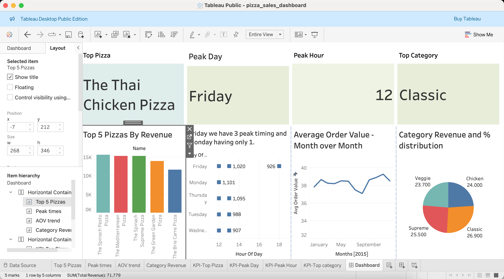

# Pizza Sales Analysis — Maven Analytics Dataset

An end-to-end data analytics project covering SQL data cleaning, business analysis across 5 key questions, and an interactive Tableau dashboard — built on a full year of pizza restaurant order data.

---

## Dashboard Preview



---

## Project Overview

| Detail | Info |
|---|---|
| Dataset | Maven Analytics — Pizza Sales |
| Period | January 2015 – December 2015 |
| Records | ~48,620 order line items |
| Database | PostgreSQL |
| Visualisation | Tableau Public |
| Author | Vijaya Kumar Kanipakam|

---

## Folder Structure

```
pizza-sales-analysis/
├── sql/
│   ├── 01_cleaning.sql       # Schema creation + all data quality checks
│   └── 02_analysis.sql       # 5 business question queries
├── data/
│   ├── q1_revenue_rankings.csv
│   ├── q2_peak_times.csv
│   ├── q3_aov_trend.csv
│   ├── q4_category_revenue.csv
│   └── q5_kpi_summary.csv
├── dashboard/
│   └── pizza_sales_dashboard.twb
├── pizza_sales_dashboard.png
└── README.md
```

---

## Tools & Skills Used

- **PostgreSQL** — schema design, DDL, data import
- **SQL** — JOINs across 4 tables, window functions (`SUM() OVER()`), `TO_CHAR`, `EXTRACT`, subqueries
- **Tableau Public** — KPI cards, bar charts, heatmap matrix, line chart, pie chart, dashboard layout
- **Git / GitHub** — version control and project portfolio

---

## Database Schema

Four tables joined across a chain of foreign keys:

```
orders ──► order_details ──► pizzas ──► pizza_types
(date,time)  (qty,pizza_id)   (price,size)  (name,category)
```

```sql
orders          → order_id, date, time
order_details   → order_details_id, order_id, pizza_id, quantity
pizzas          → pizza_id, pizza_type_id, size, price
pizza_types     → pizza_type_id, name, category, ingredients
```

---

## Data Cleaning (01_cleaning.sql)

All checks returned 0 issues — dataset is clean.

| Check | Table(s) | Result |
|---|---|---|
| NULL values | All 4 tables | 0 nulls found |
| Duplicate primary keys | orders, order_details, pizzas | 0 duplicates |
| Price ≤ 0 | pizzas | 0 invalid prices |
| Quantity ≤ 0 | order_details | 0 invalid quantities |
| Date range | orders | 2015-01-01 to 2015-12-31 ✓ |
| Invalid time format | orders | 0 issues |
| Invalid size values | pizzas | S, M, L, XL, XXL only ✓ |
| Invalid categories | pizza_types | Classic, Supreme, Chicken, Veggie only ✓ |
| Whitespace in name | pizza_types | 0 issues |

---

## Business Questions & Findings (02_analysis.sql)

### Q1 — Top 5 and Bottom 5 Pizzas by Revenue

```sql
SELECT pt.name,
    SUM(o.quantity * p.price) AS total_revenue
FROM order_details o
JOIN pizzas p ON o.pizza_id = p.pizza_id
JOIN pizza_types pt ON p.pizza_type_id = pt.pizza_type_id
GROUP BY pt.name
ORDER BY total_revenue DESC
LIMIT 5;
```

**Top 5 — promote these:**

| Pizza | Revenue |
|---|---|
| The Thai Chicken Pizza | $43,434 |
| The Barbecue Chicken Pizza | $42,768 |
| The California Chicken Pizza | $41,410 |
| The Classic Deluxe Pizza | $38,181 |
| The Spicy Italian Pizza | $34,831 |

**Bottom 5 — review for retirement:**

| Pizza | Revenue |
|---|---|
| The Brie Carre Pizza | $11,589 |
| The Green Garden Pizza | $13,956 |
| The Spinach Supreme Pizza | $15,278 |
| The Mediterranean Pizza | $15,361 |
| The Spinach Pesto Pizza | $15,596 |

---

### Q2 — Peak Order Day and Time

```sql
SELECT TO_CHAR(o.date,'Day') AS day_of_week,
    EXTRACT(HOUR FROM o.time) AS hour_of_day,
    COUNT(DISTINCT o.order_id) AS total_orders
FROM orders o
JOIN order_details od ON o.order_id = od.order_id
GROUP BY day_of_week, hour_of_day
ORDER BY total_orders DESC
LIMIT 10;
```

**Finding:** Friday is the peak day. The 12 PM–1 PM lunch window is the busiest hour across every day of the week. Monday and Thursday follow Friday in total volume.

---

### Q3 — Average Order Value Trend Month over Month

```sql
SELECT
    TO_CHAR(o.date,'YYYY-MM') AS month,
    ROUND((SUM(od.quantity * p.price) / COUNT(DISTINCT o.order_id)), 2) AS avg_order_value
FROM orders o
JOIN order_details od ON o.order_id = od.order_id
JOIN pizzas p ON od.pizza_id = p.pizza_id
GROUP BY month
ORDER BY month;
```

| Month | Avg Order Value |
|---|---|
| Jan 2015 | $37.83 |
| Feb 2015 | $38.67 |
| Mar 2015 | $38.26 |
| Apr 2015 | $38.21 |
| May 2015 | $38.53 |
| Jun 2015 | $38.48 |
| Jul 2015 | $37.50 |
| Aug 2015 | $37.09 (lowest) |
| Sep 2015 | $38.64 |
| Oct 2015 | $38.90 |
| Nov 2015 | $39.28 (highest) |
| Dec 2015 | $38.51 |

**Finding:** AOV is relatively stable (~$37–$39) throughout the year. It dips in summer (Jul–Aug) and peaks in November — a potential opportunity for seasonal promotions.

---

### Q4 — Revenue by Pizza Category

```sql
SELECT
    pt.category,
    SUM(od.quantity * p.price) AS total_revenue,
    ROUND(SUM(od.quantity * p.price) * 100.0 /
        SUM(SUM(od.quantity * p.price)) OVER(), 1) AS pct_of_total
FROM pizza_types pt
JOIN pizzas p ON pt.pizza_type_id = p.pizza_type_id
JOIN order_details od ON p.pizza_id = od.pizza_id
GROUP BY pt.category
ORDER BY total_revenue DESC;
```

| Category | Revenue | % of Total |
|---|---|---|
| Classic | $220,053 | 26.9% |
| Supreme | $208,197 | 25.5% |
| Chicken | $195,920 | 24.0% |
| Veggie | $193,690 | 23.7% |

**Finding:** Revenue is very evenly distributed across all 4 categories — Classic leads but only by ~3% over Veggie. No single category dominates, suggesting a well-balanced menu.

---

### Q5 — Store Manager Recommendation

```sql
SELECT
    (SELECT pt.name FROM pizza_types pt
     JOIN pizzas p ON pt.pizza_type_id = p.pizza_type_id
     JOIN order_details od ON p.pizza_id = od.pizza_id
     GROUP BY pt.name ORDER BY SUM(od.quantity * p.price) DESC LIMIT 1) AS top_pizza,
    (SELECT TO_CHAR(date,'Day') FROM orders
     GROUP BY TO_CHAR(date,'Day') ORDER BY COUNT(*) DESC LIMIT 1) AS peak_day,
    (SELECT EXTRACT(HOUR FROM time) FROM orders
     GROUP BY EXTRACT(HOUR FROM time) ORDER BY COUNT(*) DESC LIMIT 1) AS peak_hour,
    (SELECT pt.category FROM pizza_types pt
     JOIN pizzas p ON pt.pizza_type_id = p.pizza_type_id
     JOIN order_details od ON p.pizza_id = od.pizza_id
     GROUP BY pt.category ORDER BY SUM(od.quantity * p.price) DESC LIMIT 1) AS top_category;
```

**Result:** Thai Chicken Pizza | Friday | 12 PM | Classic

---

## Manager Recommendation

Based on full-year 2015 analysis of 48,620 order line items:

**Staff & Operations**
Friday lunch (12–1 PM) is the single highest-volume window of the week. Ensure full staffing every Friday from 11:30 AM. Monday and Thursday also show strong midday peaks — consider a second shift overlap on these days.

**Menu Strategy**
The Thai Chicken Pizza leads all revenue at $43,434. Feature it prominently in promotions and on the front of the menu. The bottom 3 pizzas (Brie Carre, Green Garden, Spinach Supreme) together account for less than 5% of revenue — retiring or reworking these SKUs would simplify operations without meaningful revenue loss.

**Pricing Opportunity**
Average order value dips to $37.09 in August — the lowest point of the year. A targeted August promotion (e.g. combo deals or a loyalty offer) could lift this to match the November peak of $39.28, recovering approximately $2 per order across the month.

**Category Balance**
All 4 categories sit within 3% of each other in revenue share. This is healthy — avoid over-investing in one category. Instead, use the Classic category's slight lead to anchor combo deals with lower-performing Veggie items.

---

## How to Run This Project

```bash
# 1. Clone the repository
git clone https://github.com/Vijay2705bp/pizza-sales-analysis.git
cd pizza-sales-analysis

# 2. Set up PostgreSQL and create the database
psql -U postgres -c "CREATE DATABASE pizza_sales;"

# 3. Run schema creation and data cleaning
psql -U postgres -d pizza_sales -f sql/01_cleaning.sql

# 4. Import the 4 CSVs using pgAdmin or psql \COPY command

# 5. Run the analysis queries
psql -U postgres -d pizza_sales -f sql/02_analysis.sql

# 6. Open the dashboard
# Open pizza_sales_dashboard.twb in Tableau Public Desktop
# Point data source to the /data/ CSV files
```

---

## Key Learnings

- Practiced multi-table JOINs across a real relational schema (4 tables, 3 joins)
- Used PostgreSQL window functions (`SUM() OVER()`) for percentage-of-total calculations
- Built a complete data cleaning checklist before any analysis — a professional habit
- Translated SQL results into a business narrative a non-technical manager can act on
- Delivered a full end-to-end project: raw data → cleaned schema → analysis → dashboard → recommendation

---

## 👨‍💻Author - Vijaya Kumar Kanipakam

This project is part of my portfolio, showcasing the SQL skills essential for data analyst/Analyst/SQL/data scientist roles. If you have any questions, feedback, or would like to collaborate, feel free to get in touch!

### Stay Updated and Join the Community

For more content on SQL, data analysis, and other data-related topics, make sure to follow me on social media and join our community:

- **LinkedIn**: [Connect with me professionally](https://www.linkedin.com/in/vijay-kumar-2705m/)

Thank you for your support, and I look forward to connecting with you!
